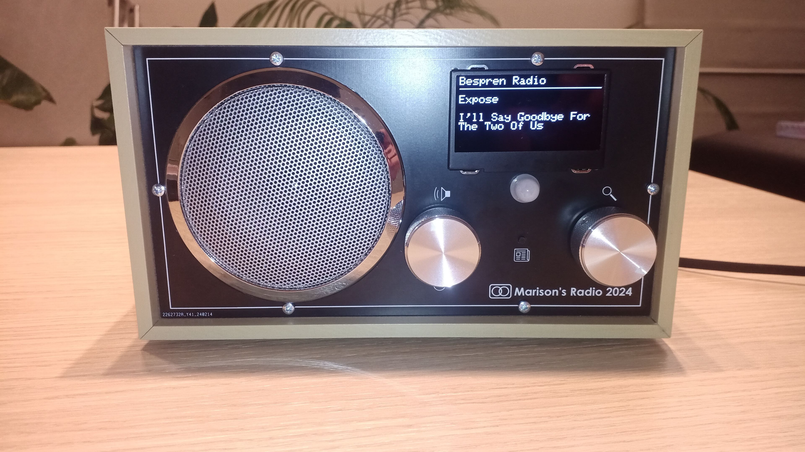
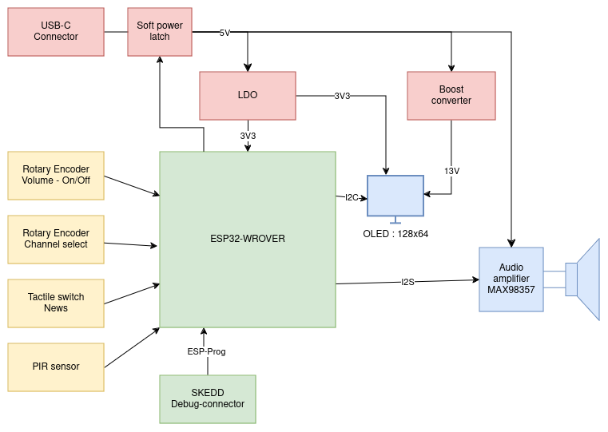

# Description

<td>
<table>
  <tr>
    <td>
      
    </td>
    <td>
      
    </td>
  </tr>
</table>

# Hardware version 1.0
* [Release binaries](https://github.com/LieBtrau/esp32-web-radio/releases/tag/hw_1.0.0) (gerber data, BoM, PDF schematics, PDF PCB assembly drawing)
* Online Altium viewer (schematic, PCB, 3D view, Draftsman drawing, BoM):
  * [Logic board](https://365.altium.com/files/4109E801-90D9-4754-8810-C3B9F4649D15)
  * [Front panel](https://365.altium.com/files/9F6788B9-9D0B-400C-A80F-A1CFE65F462F)
  * [Power entry module](https://365.altium.com/files/06756B94-5B1C-4D01-91C6-53AC24E7E911)
* Test reports
  * [Logic board](./hardware/testReports/TR_web-radio_1.0.0.md)
  * [Front panel](./hardware/testReports/TR_front-panel_1.0.0.md)
  * [Power entry module](./hardware/testReports/TR_power-entry_1.0.0.md)

# Hardware version 1.1
PCB data with corrections and improvements will be released in the future. It's unclear whether new hardware will be produced. The current hardware is working fine after patching. Ordering new hardware is expensive, wasteful, and time-consuming.

# Why web radio instead of DAB+?
* DAB+ is limited to local radio stations. Web radio gives access to radio stations from all over the world.
* DAB+ reception quality is not great indoors. The radio must be located near a window and the antenna must be fully extended.
* Sound quality won't probably be worse than DAB+. I'm using a cheap speaker anyway.
* DAB+ is free, but in most places, a Wi-Fi connection is available anyway. The data consumption is low (about 30 MB per hour for a low-quality 64kbps).
* DAB+ receiver modules are not widely available. The probably aren't cheap either.

I think DAB+ has its niche in car radios, but not in home radios.

----
The original repository can be found [here](https://github.com/LieBtrau/esp32-web-radio).